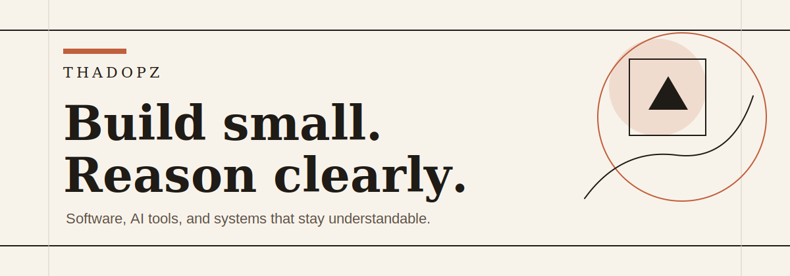

  

 

  
  

---

## About

I am Thadopz. I care about building software that is practical, readable, and durable.

This profile is a small index of what I am learning, building, and refining over time.

## Current Focus

- Designing clear developer workflows
- Building useful AI-assisted tools
- Keeping systems simple enough to reason about
- Turning small ideas into working projects

## Working Style

| Principle | What it means |
| --- | --- |
| Clarity first | Code, docs, and interfaces should explain themselves. |
| Useful by default | A project should solve a real problem before it becomes elaborate. |
| Measured complexity | Add structure when it earns its place. |

## Tech Notes

  

## GitHub Activity

  
  

## Contact

  

